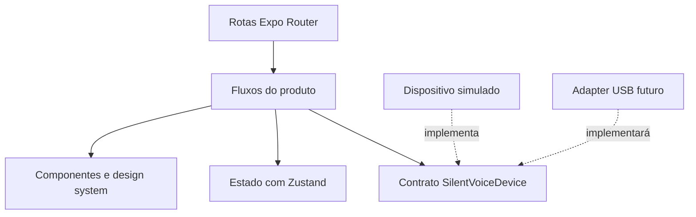
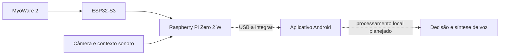

<div align="center">
  <h1>Silent Voice Mobile</h1>
  <p><strong>Experiência mobile para um projeto de comunicação assistiva com IA multimodal.</strong></p>
  <p>
  
  
  
  </p>
  <p>
    <a href="#visão-geral">Visão geral</a> ·
    <a href="#tecnologias">Tecnologias</a> ·
    <a href="#arquitetura">Arquitetura</a> ·
    <a href="#como-executar">Como executar</a> ·
    <a href="#documentação">Documentação</a>
  </p>
</div>

---

## Visão geral

**Silent Voice Mobile** é a aplicação mobile do Silent Voice, projeto que investiga formas de apoiar a comunicação por meio da combinação de sinais musculares, informação visual e contexto sonoro.

O aplicativo organiza a experiência entre usuário e dispositivo: apresentação do produto, preparação da sessão, conexão, calibração, acompanhamento da comunicação e consulta de informações do sistema. O objetivo é transformar uma arquitetura multimodal complexa em uma interface compreensível.

**O foco deste repositório é a experiência mobile e a arquitetura de integração.** A versão atual permite explorar os fluxos com dados demonstrativos. A comunicação USB real, os modelos de IA e a síntese de voz ainda precisam ser integrados ao aplicativo.

### Destaques de engenharia

- **Interface desacoplada do hardware:** o contrato `SilentVoiceDevice` separa os fluxos de produto da implementação física do dispositivo.
- **Organização por funcionalidades:** navegação, domínio, estado e componentes visuais têm responsabilidades distintas.
- **Design system próprio:** tokens de cor, tipografia, espaçamento e componentes reutilizáveis mantêm consistência entre as telas.
- **Estados demonstrativos determinísticos:** conexão e telemetria podem ser inspecionadas sem depender da disponibilidade do hardware.

## Experiência do produto

| Fluxo | O que pode ser explorado no aplicativo |
| --- | --- |
| Apresentação e preparação | Entrada no produto, onboarding e interfaces de preparação da sessão. |
| Conexão | Estados de espera, detecção, autorização e falha, representados por simulação. |
| Calibração | Fluxo visual de preparação para o uso do dispositivo. |
| Comunicação ao vivo | Interface da sessão e representação das etapas de captura e validação. |
| Histórico e configurações | Organização visual das informações de comunicação e preferências. |
| Visão do sistema | Apresentação de módulos e indicadores demonstrativos de saúde operacional. |

## Tecnologias

**Aplicação mobile**


**Estado e interface**


**Qualidade e ferramentas**


As dependências e os comandos disponíveis estão em [`package.json`](package.json).

## Arquitetura

### Aplicação



As rotas em `app/` são entradas leves. A implementação dos fluxos fica em `src/features/`, enquanto contratos de domínio e tokens visuais permanecem independentes das telas.

### Integração física planejada



O Android deverá conversar com o Raspberry Pi, que atua como gateway. O protocolo USB e o adapter concreto dependem de validação física. O funcionamento local e offline é uma diretriz do MVP, não uma integração já concluída neste repositório.

Consulte a [arquitetura documentada](docs/architecture.md) para os contratos, responsabilidades e limites de cada componente.

## Decisões de interface

O design system privilegia superfícies limpas, feedback de estado e hierarquia tipográfica. Os componentes documentam alvos de toque, estados de acessibilidade, safe areas e respeito à preferência de redução de movimento.

Tokens e componentes são reutilizados entre funcionalidades para evitar que cada tela desenvolva uma linguagem visual própria. A especificação está em [`docs/design-system.md`](docs/design-system.md).

## Estrutura do repositório

```text
silent-voice-mobile/
├── app/                 # Rotas e composição global
├── assets/              # Recursos visuais locais
├── docs/                # Arquitetura, design system e especificações
├── src/
│   ├── components/      # Primitivas e padrões de interface
│   ├── domain/          # Contratos e tipos do produto
│   ├── features/        # Fluxos organizados por funcionalidade
│   ├── hooks/           # Comportamentos reutilizáveis
│   ├── stores/          # Estado com Zustand
│   └── theme/           # Tokens visuais
└── package.json
```

## Como executar

### Preparação

Tenha Git, Node.js e npm instalados em versões compatíveis com o SDK Expo declarado em `package.json`. Para explorar os fluxos simulados, não é necessário conectar o hardware do Silent Voice.

```bash
git clone https://github.com/andreiolicar/silent-voice-mobile.git
cd silent-voice-mobile
npm ci
npm start
```

Outros alvos disponíveis:

```bash
npm run web
npm run android
npm run ios
```

Use o alvo compatível com seu ambiente de desenvolvimento. A visualização web serve para inspecionar a interface; não representa uma implementação do transporte USB Android.

### Roteiro de exploração

Comece pela apresentação e pelo onboarding, avance para a tela de conexão e percorra os fluxos de calibração, comunicação e visão do sistema. Observe como cada estado altera o feedback da interface.

## Qualidade

Os comandos atuais verificam lint, tipos e formatação:

```bash
npm run lint
npm run typecheck
npm run format:check
```

A verificação atual cobre análise estática e consistência do código. O `package.json` ainda não inclui um comando para testes automatizados de fluxos.

## Próximas integrações

O avanço do produto passa pela definição do protocolo USB, implementação do adapter físico, integração do processamento multimodal e da síntese de voz, além da validação dos fluxos em dispositivos reais.

## Documentação

| Material | Conteúdo |
| --- | --- |
| [Arquitetura](docs/architecture.md) | Contratos, integração física planejada e fronteiras do aplicativo. |
| [Design system](docs/design-system.md) | Tokens, componentes, interação e acessibilidade. |
| [Especificações de desenvolvimento](docs/superpowers/specs/) | Decisões registradas para evolução dos fluxos. |
| [Dependências e scripts](package.json) | Configuração executável da aplicação. |

## Autoria e contato

**Andrei Carneiro — desenvolvimento de software no projeto Silent Voice.**

Este repositório reúne a camada mobile de um projeto colaborativo de tecnologia assistiva, com foco em experiência do usuário, organização de estado e integração entre software e dispositivo.

A base Expo mantém seus créditos no arquivo [`LICENSE`](LICENSE).

[](https://www.linkedin.com/in/andrei-carneiro-0a35b8310/)
[](https://github.com/andreiolicar)
